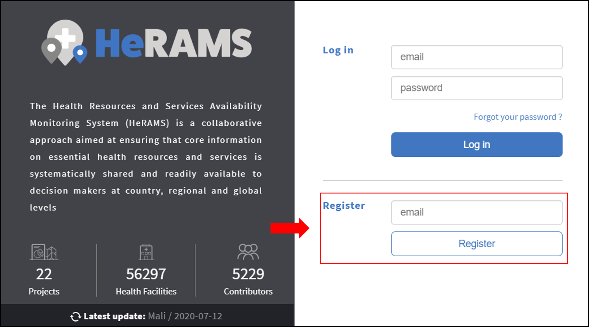
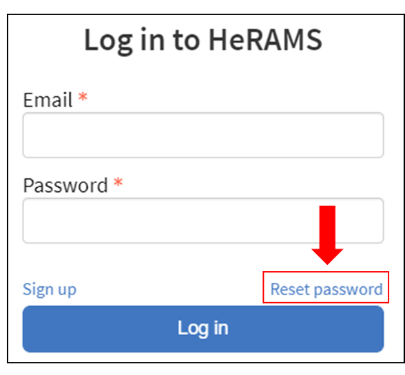
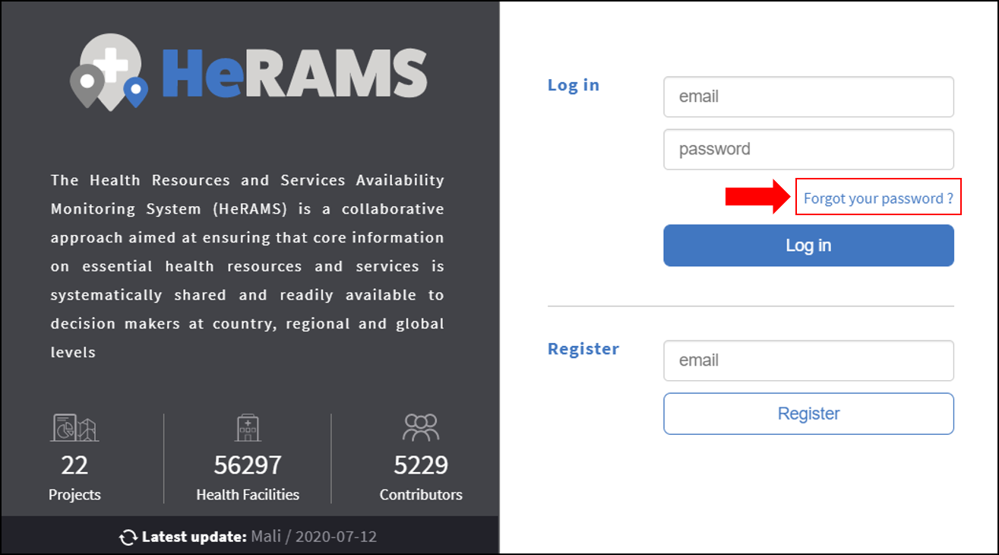
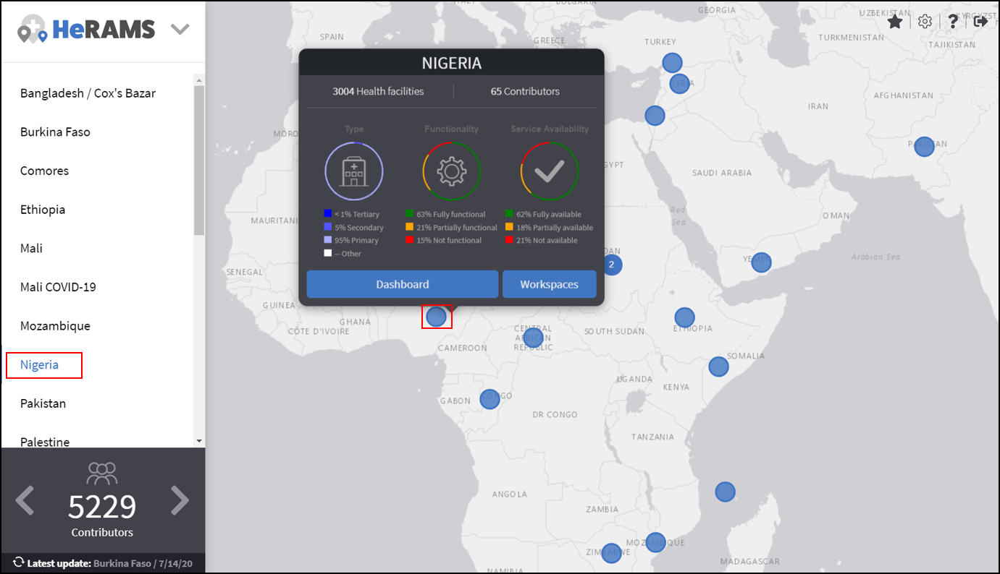
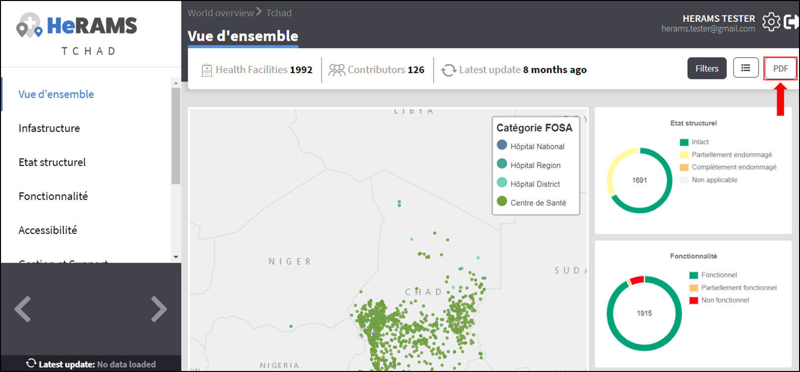
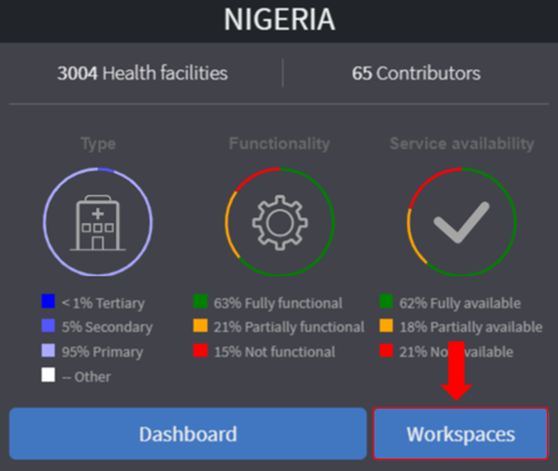
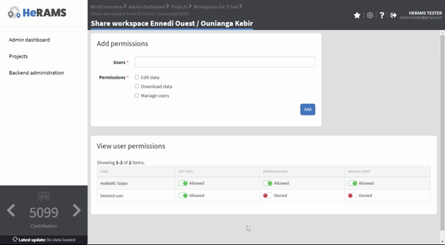
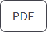
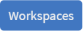

  

.. image:: media/img/HeRAMS.png
   :height: 100px
   :alt: HeRAMS Logo
   :align: center

	
Introduction
============

Welcome to the **HeRAMS User Guide**. This user guide was designed for users of the `HeRAMS platform <https://herams.org/>`_. It provides step-by-step instruction on how to register and access the platform as well as a brief overview on key components of the platform, including detailed information on how to explore the available data using the interactive dashboards. Data managers can find additional information on how edit data in the `Edit Data`_ section.
For more advanced topics related to user management and project administration, please consult the `HeRAMS Administration`_ section.

It should be noted that the guide only addresses issues related to the `HeRAMS platform <https://herams.org/>`_. 
For general information on the HeRAMS approach and for technical guidance please consult the official `WHO HeRAMS webpage <https://www.who.int/hac/herams/en//>`_. For additional questions that are not covered in this guide, please contact the `HeRAMS Support Team <mailto:herams@who.int?>`_.

Getting started
===============

This chapter is intended for new users of the `HeRAMS platform <https://herams.org/>`_ platform. It covers all issues related to registering and accessing the platform as well as managing your user profile. To help you navigate the platform on your own, the last section of this chapter provides an explanation to the different icons used across the platform. 

Creating a User Account
-----------------------

1. To register as a new user, open the link `herams.org <https://herams.org>`_ in your browser.

.. tip:: It is strongly recommended to either user FireFox or Chrome.

2. In the lower half of the screen you should see an option to register as new user. Enter your email address and click the |register|.

4. A confirmation email will be sent to the email address you entered. Confirm your registration by clicking the link in your email.
   
.. tip:: If you don't receive a confirmation email within a few minutes, check your spam folder.

5. A new tab will open prompting you to enter your name and password. Click the |register-blue| button to finalize your registration.

.. note:: If you are not automatically logged-in, please follow the steps outlined below to login as exisitng user. 

.. image:: media/vid/HeRAMS_register.gif
    :align: center

Logging in
----------

.. note:: New users without an existing account, will have to register before being able to login to the HeRAMS platform. To create a user account, follow the instructions `here <#creating-a-user-account>`_.

1. Open the link `herams.org <https://herams.org>`_ in your browser.
2. Enter your email address and password in the designated fields in the top half of the page and click the |login| button.

   

.. tip:: It is strongly recommended to either user FireFox or Chrome.

Logging out
-----------

To logout click the |logout| button in the top right corner of the screen.

Reset password
--------------

In case you forgot your password, the instructions below will guide you through the steps to reset your password.

1. Open the link `herams.org <https://herams.org>`_ in your browser.
2. On the sign in page, click the `Forgot your password <https://herams.org/user/request-reset>`_ link.

3. Enter your email address in the designated field and click the |submit-en| button.
4. You will receive an email with a password reset link. Click the link in the email to open the password reset page. 

.. note:: If you did not receive this email within a few minutes, check your spam folder.

5. On the page that opens, enter your new password. 
6. Click the |reset-password| button to confirm your new password.
7. You have now successfully changed your password. To access the HeRAMS platform, return to the `sign in page <https://herams.org>`_ and enter your credentials.

Update your User Profile
------------------------
Each user has a profile associated with their account. This permits you to change your user name, email address or password without requiring additional support.

1. To update your user profile, click your username shown on the top right corner of the page.
2. This opens your `user profile <https://herams.org/user/account>`_ and allows you to change your personal information.

Change Password
---------------

1. To change your password, open your user profile as explained `above <#update-your-user-profile>`_.
2. In the pop-up window that opens, select the `Password`  tab.  
3. You should be able to change your email address and enter a new password.
4. Make sure to click the |update-password-en| button to confirm your changes.
5. To return to the main page, close the pop-up by clicking the X in the top right corner.

.. image:: media/vid/HeRAMS_change_password.gif
   :alt: change password video
   :align: center
   :height: 300px
   
Change Language Preference
---------------------------
The HeRAMS platform is available in multiple language. Unless specified otherwise, the language will be automatically adjusted based on your browser language. 
For users having a browser language that is not supported by HeRAMS, the language will default to English. To manually adjust your language preference, follow the steps below. 

1. To change your language preference, open your user profile as explained `above <#update-your-user-profile>`_.
2. In the pop-up window that opens, navigate to the **Profile** tab.  
3. Change the drop-down list to desired language and click the |update-profile| button.

.. note:: HeRAMS will remember your language preferences next time you log-in. If you would like to change them, you must return to this page and update your user profile.

.. image:: media/img/HeRAMS_language_settings.png
   :alt: change password video
   :align: center
   :height: 300px

Change Email Address
--------------------
1. To change your e-mail address, open your user profile as explained `above <#update-your-user-profile>`_.
2. Open the **Email** tab and enter the new email address you would like to use for your HeRAMS account.
3. Click the |send-confirmation| button. This will send a confirmation email to your new email address.
4. Click the link in the confirmation email to validate your new email address.
   
Icons and Their Meaning
-----------------------
This section aims to provide an overview of key icons used accross the platfrom and explains their meanings.

* |favorites| **Favorites**: This allows you to create a personal list of favorite workspaces, accessible directly from the world map. See `Favorites`__ to learn more about how to add worksapces to your list Favorites.
* |settings| **Settings**: Use this button to access the HeRAMS admin interface. For more information on the HeRAMS admin interface is available in the `HeRAMS_Administration`__ chapter.
* |user-guide| **User Guide**: Opens the HeRAMS user-guide.
* |workspace| **Workspaces**: This opens the list of all available workspace of a project. See `here <#workspaces>`__ for more information on workspaces. 
* |dashboard| **Dashboard**: Opens the `Project Dashboard`_.
* |view-black| **View Response**: Grants you view access to a specific item or record. 
* |pencil-black| **Edit**: Opens the data edit interface. More information on data editing and updating is available `here <#edit-date>`__.
* |delete-black| **Delete**: Deletes a specific item or record. 
* |refresh| **Refresh Data Cache**: This button allows users to manually refresh the data cache of a workspace. Data is automatically refreshed every 30 minutes. This means if a record is updated, the changes are not immediately reflected on the dashboard. Thus, by manually refreshing the data cache of a workspace the time lag limitation can be overcome and the changes made will become visible immediately.
* |download| **Download Data**: Opens the download interface, allowing you to export your data for further analysis in external applications. See `Download Data`_ for more information.
* |pencil-thin| **Update Workspace**:  Enables you to alter the settings of an item (e.g. workspace, dashboard element, etc.)
* |share-icon| **Share Workspace**: Opens the user management page of a project or workspace. For more information on go to `User_management`__

.. note: The number of buttons visible to you depends on your `user role<#user-roles>` and might vary from one workspace/project to another.

Breadcrumbs
-----------------------
Across the platform, breadcrumb trails shown on top of every page. The intend to help you navigate the platform more effectively and 
provide a simple way to access previous pages. For example, the image below displays a sub-page of the Nigeria dashboard. 
To return to the first page of the dashboard, click on **Nigeria** in the breadcrumb trail.

.. image:: media/img/HeRAMS_navigation_pane.png
   :height: 30px
   :align: center

View a Project
=================

This chapter describes how to explore projects by accessing real-time analytics available in the HeRAMS platform. For each project, the HeRAMS platform provides a high level overview on key indicators such as the number of health facilities assessed,
and overall functionality and service availability of a project. Interactive dashboards provide additional insights into individual projects and allow for users to focus on specific areas of interest. 

Project Overview
----------------

After logging in, you will see a world map with several blue dots. Each of these dots represents a HeRAMS project.
You can also see the list of all available projects in the navigation pane on the left. 
In addition, a brief summary on the number of projects available in HeRAMS, the total number of contributors and health facilities is shown in the bottom left corner.

1.	To learn more about a project, either click the blue dot on the world map or select the project from the navigation pane on the left.
2.	You should now see a pop-up window displaying an overview of the selected project. In the upper part of the pop-up you can see the project name, the number of health facilities assessed as well as the number of contributors. The lower half of the pop-up window displays a brief summary on the distribution of health facility types, their functionality and service availability.
3.	For further details, click the |dashboard| button. This will open the project dashboard.
	
.. tip:: Access to the project dashboards is restricted to selected users. If you would like to be granted access to a project dashboard, please contact your country focal point or send an email to `herams@who.int <mailto:herams@who.int?>`_ specifying your function and role as well as a brief explanation why you would like to access the dashboard.

Project Dashboard
------------------
Each project in HeRAMS has a custom interactive dashboard providing an instant and in-depth analysis based on the available data.

1. To view a project dashboard, open the project summary by selecting your project from the navigation pane on the left. Alternatively, you can open the project summary by clicking the corresponding blue dot on the world map.
2. In the pop-up window, click the |details| button. This will open the interactive dashboard.
3. You should now see a page similar to the one shown below. In the navigation pane on the left you will find a list of all available pages.
    
.. image:: media/img/HeRAMS_dashboard_overview.png
   :alt: HeRAMS Register
   :height: 300px
   :align: center

4. To open a page, click the page name in the navigation pane.

.. tip:: Some pages may contain a sub-page, indicated by a |forward| icon next to the page's name.

.. tip:: If you hover with your mouse over a point on a map or a chart, a small pop-up message will appear, displaying additional details.

The animation below shows the dashboards in action.

.. image:: media/vid/HeRAMS_dashboard_navigation.gif
   :alt: dashboard navigation
   :height: 300px
   :align: center

Customizing a dashboard
~~~~~~~~~~~~~~~~~~~~~~~
This section provides a few tips and tricks on how to customize the dashboard by applying filters and alter some of default display options.

Apply filters
"""""""""""""

Data on the dashboard can be filtered. This allows you to scrutinize the data subsets that are of interest to you.

.. note:: Filtering is not persistent and only visible during your current session.

1. In the top right corner of the dashboard, click the |filter| button.
2. You should now see the filtering setting page. Use the drop-down list to select your filter criteria. Repeat this process until you have added all the desired filter criteria.

.. note:: If you apply multiple search criteria, only results that contain all terms will be shown.

.. tip:: You can limit the number of fields displayed using the search field on top of the page.

3. Click the |applyfilter| button to activate your filter.
4. To remove the filters, return to the **Filter** pages and click the |clearfilter| button.

.. image:: media/vid/HeRAMS_dashboard_filters.gif
   :height: 300px
   :align: center

Map Zoom Level and Focus Area
"""""""""""""""""""""""""""""

You can adjust the zoom level of a map by using the scroll button on your mouse. To change the focus area of a map, position you mouse in the map element. Right click (hold) and drag the map in the desired direction. This will move the map focus area.

Remove a Category from Charts or Maps
"""""""""""""""""""""""""""""""""""""

By clicking the icons in the legend, you can remove a category from a chart or map. To add it again, simply click the circle again.

Reorder map layers
""""""""""""""""""

Depending on the zoom level applied to a map, it may happen that several points lie on top of each other, hiding some facilities. To bring a specific category to the front, uncheck the category in the legend. This will remove the category from the map. If you add the category again (click the now empty circle), the category will be added on top of the other points.

.. image:: media/vid/HeRAMS_dashboard_customize_maps.gif
   :height: 300px
   
   

Exporting a dashboard
~~~~~~~~~~~~~~~~~~~~~~~
Dashboards can be printed or exported as PDF document. 

.. note:: The export will include any filters that might applied. 

1. To export a dashboard, open the desired dashboard as explained `here <#view-a-project-dashboard>`__.
2. Click the |pdf| icon in the top right corner of your screen.

3. This will open a new tab containing a printable version of the dashboard. Click `CTRL`+ `P` to print the dashboard or save it as a pdf. 

Default dashboard pages
~~~~~~~~~~~~~~~~~~~~~~~

The below section provides an overview of the standard pages available in a dashboard. Each page refers to a HeRAMS standard information pillar.

.. note:: The order and the content of dashboards are customized individually based on each project's need. Your dashboard might, therefore, be substantially different from the example pages displayed below.

Overview
""""""""

The **Overview** page provides a summary, in form of:

*	a map to spot the distribution and number of health facilities by level of care (i.e. primary, secondary and tertiary health care facilities); and
*	donut charts to summarize different indicators, such as level of damage, functionality status, accessibility and service availability in the assessed health facility.

.. note:: The service availability indicator is country-specific. Thus, direct comparisons from one country to another should be avoided.

.. image:: media/img/HeRAMS_dashboard_overview.png
   :height: 300px
   :align: center

Infrastructure
""""""""""""""

The **Infrastructure** page displays a descriptive analysis, including:

* a map to spot the distribution and number of health facilities by type;
* donut charts to illustrate **Mo**\des of **S**\ervice **D**\elivery (**MoSD**\s) by type as well as the modality of the building structure (permanent vs. temporary); and
* a table to illustrate reported accessibility barriers.

.. image:: media/img/HeRAMS_dashboard_infastructure.png
   :height: 300px
   :align: center

Condition
"""""""""

The **Condition** page displays the level of reported damage to MoSD buildings following a standard classification and scale (Not Damaged to Fully Damaged). Information is visualized as:

*	a map to spot the distribution and number of health facilities according to the level of building damage (i.e. condition);
*	donut charts summarizing the reported level of building damage by level of severity as well as the distribution of MoSD by type; and
*	a table to provide the name of the prioritized localities in terms of damage and their main causes.

.. image:: media/img/HeRAMS_dashboard_condition.png
   :height: 300px
   :align: center
   
Functionality
"""""""""""""

The **Functionality** page displays the level of functionality of the MoSDs following a standard classification and scale (Fully Functioning to Not Functioning) represented as:

*	a map to spot the distribution and number of MoSDs according to the functionality status;
*	donut charts to summarize the level of functionality as well as main causes of non-functionality; and
*	a table displays the list of priority areas in terms of non-functional health facilities and reported causes.

.. image:: media/img/HeRAMS_dashboard_functionality.png
   :height: 300px
   :align: center
   
Accessibility
"""""""""""""

The **Accessibility** page displays the level of accessibility to MoSDs following a standard classification and scale (Fully Accessible to Not Accessible) in the form of:

*	a map to spot the distribution and number of MoSDs according to the accessibility status;
*	donut charts to summarize the level of accessibility per number of MoSDs as well as the reported causes of inaccessibility per number of MoSDs; and
*	a table displays the list of priority areas with inaccessible MoSDs and the main reported cause of inaccessibility.

.. image:: media/img/HeRAMS_dashboard_accessibility.png
   :height: 300px
   :align: center
   
Management & support
""""""""""""""""""""

The **Management & support** page displays information on the management of the MoSDs and the level of support provided by partners. The information is illustrated in terms of:

* Ownership:

  * A map to spot the distribution of MoSDs according to their ownership (i.e. public, private, faith-based and, NGO/iNGO).
  * A donut chart to highlight the categories of ownership as a percentage of the total number of MoSDs.

* External support:

  * A donut  chart to illustrate the level of support provided by partners.

.. image:: media/img/HeRAMS_dashboard_management_support.png
   :height: 300px
   :align: center
   
Basic Amenities
"""""""""""""""

Information on **Basic Amenities** is presented in a series of subpages. Each subpage is dedicated to a particular category and includes:

* a map displying the availability and sufficiency of the basic amenity; and
* donut charts highlighting the percentage of MoSDs with sufficient availability of the amenity as well as main sources.

.. image:: media/img/HeRAMS_dashboard_basic_amenities.png
   :height: 300px
   :align: center
   
Service Availability
""""""""""""""""""""

The **Service Availability** page displays multiple pages per type of service. Each page displays:

*	a map to spot the distribution of the MoSDs providing the selected health service;
*	donut charts to summarize the level of service availability as well as the underlying causes of unavailability of the service; and
*	a table displaying the list of priority areas per service unavailability and the main reported underlying causes.

.. image:: media/img/HeRAMS_dashboard_service_availability.png
   :height: 300px
   :align: center

Contribute Data
===============

This chapter is intended for data managers responsible to update HeRAMS data. It covers all aspects related to data editing, including registering new health facilities, updating the status of existing health facilities as well as deleting erroneous records (e.g. duplicates). 

.. note:: Access to the data edit interface is limited to users responsible to update the data. If you require your access permissions to be changed, kindly contact the *Workspace Owner*, your *Project Admin* or send an email to `herams@who.int <mailto:herams@who.int?>`_ specifying your function and role as well as a brief explanation on why you would like your access permissions to altered.

Access your workspace
--------------------------------
HeRAMS uses so-called *Workspaces* to manage access permission to the underlying data.
A workspace may include all health facilities of a geographical region, health facilities managed by a specific partner or any other logical category. 
Each workspace has a dedicated focal point, the *Workspace Owner*, who is responsible for updating and maintaining health facility records of their workspace. 
*Workspace Owners* may invite additional users to contribute to their data. 
For more information on how to grant users access to workspace please view the `User_management`__ section. 

1. Open the project summary pop-up by selecting your project from the navigation pane on the left. Alternatively, you can open the project summary by clicking the corresponding blue dot on the world map.
2. Click the |workspace| button on the bottom right corner of the pop-up.
3. This opens the list of available workspace of the selected project. For each project, the table displays the number **Workspaces**, **Contributors**, **Health facilities** and **Responses**.
  

  
.. tip:: The number of responses can be higher than the total number of health facilities. This indicates that a health facility was assessed multiple times.

5. To view the health facilities that are part of a specific workspace, click the |update-data| icon in the Action column.
6. Use the |forward-page| buttons to move to the next page or filter the workspaces by typing the workspace name in the field below the header row.

.. image:: media/img/HeRAMS_workspace_filter.png
   :height: 300px
   :alt: filter workspaces
   :align: center
   
7. You should now see a table with all the health facilities of the selected workspace.

The video below summarizes the steps to access the data entry interface.

.. image:: media/vid/HeRAMS_data_update_interface.gif
   :height: 300px
   :alt: data update interface
   :align: center
   

Edit a Health Facility Record
-----------------------------

.. Caution:: Editing a record will overwrite the existing record. If you would like to update the status of a health facility while keeping the history of changes, follow the instructions in the section `below <#add_a_response_to_a_health_facility_record>`__.

1. Open the data update interface as outlined `above <#access-the-data-update-interface>`__.
2. To ease navigation, records are grouped by health facility. To edit a specific response, you first have to expand the health facility by clicking anywhere in the corresponding row.
 
.. tip:: Keep in mind that the table might have multiple pages. Use the button in the bottom right corner to advance to the next page. You can also reduce the number of records displayed by applying filters.

.. image:: media/img/data_update_interface.png
   :height: 300px
   :alt: update data table
   :align: center
 
3. You should now see a list of all responses belonging to the selected health facility. In the left-most column of the list, there are three buttons allowing to preform the following actions. 
 
  - |view-black| view : Click this button to view the full response 
  - |pencil-black| edit: Allows you to modify an existing response. This will permanently overwrite the exisitng infomration of a response and cannot be undone.
  - |delete-black| delete: Permanently deletes a response form a health facility. See `Delete_a_response`__ for more information.
 
 .. image:: media/img/HeRAMS_data_update_interface_action_buttons.png
   :height: 300px
   :alt: update data table
   :align: center
 
.. Note:: The number of action buttons visible depends on your project's settings.
  
4. To modify a record click the |pencil-black| icon in the *Actions* columns. You should now be able to edit the selected record. Use the |next| buttons in the lower right corner to move to the next page of the questionnaire or return to the previous page. You can also use the navigation pane on the left to access a specific section of the questionnaire.
5. Make sure to validate and save your changes before exiting the record. To save your changes, navigate to the last page, **Validate**, and click the |submit| button.
6. If you would like to discard your edits, click the |clear| button in the lower right corner of the page.

.. note:: While your project may allow you to save your response and resume later, only records that were submitted will appear on the dashboard and the export. Thus, once you have completed your edits, make sure to **always** navigate to the last page, **Validate**, and click the |submit| button.

.. image:: media/vid/HeRAMS_edit_health_facility.gif
   :height: 300px
   :alt: edit records
   :align: center

Add a Response to a Health Facility Record
------------------------------------------

If HeRAMS is used as a monitoring tool, you can record changes to a health facility while keeping the existing information.

.. note:: The feature to update health facilities is not enabled in all projects. Contact your *Project Admin* or send an email to `herams@who.int <mailto:herams@who.int?>`_ for further information.

1. To update the status of a health facility, open the `data update interface <#access-the-data-update-interface>`__.
2. Click the health facility record you would like to add a response to. 
3. You should now see the history of response to the selected health facility. To add a new response, click the |add-response| button in the action column. 

 .. image:: media/img/HeRAMS_data_update_interface_add_responses.png
   :height: 300px
   :alt: update data table
   :align: center

4. You should now be able to edit the selected record. Use the |next| buttons in the lower right corner to move to the next page of the questionnaire or return to the previous page. You can also use the navigation pane on the left to access a specific section of the questionnaire.
5. Make sure to validate and save your changes before exiting the record. To save your changes, navigate to the last page, **Validate**, and click the |submit| button.
6. If you would like to discard your edits, click the |clear| button in the lower right corner of the page.

.. note:: While your project may allow you to save your repose and resume later, only records that were submitted will appear on the dashboard and the export. Thus, once you have completed your edits, make sure to **always** navigate to the last page, **Validate**, and click the |submit| button.

Register a New Health Facility
------------------------------

1. To register a new health facility, navigate to the data `update interface <#access-the-data-update-interface>`__.
2. Click the |new-record| button in the top left corner. This will open a blank form, allowing you to register a new health facility.
3. Use the |next| buttons in the lower right corner to move to the next page of the questionnaire or return to the previous page. You can also use the navigation pane on the left to access a specific section of the questionnaire.   
4. Make sure to validate and save your changes before exiting the record. To save your changes, navigate to the last page, **Validate**, and click the |submit| button. 
5. If you would like to discard your edits, click the |clear| button in the lower right corner of the page.

.. note:: While your project may allow you to save your response and resume later, only records that were submitted will appear on the dashboard and the export. Thus, once you have completed your edits, make sure to **always** navigate to the last page, **Validate**, and click the |submit| button.

Remove a Response from Health Facility 
-------------------------------------

1. To delete a response from a health facility, open the `data update interface <#access-the-data-update-interface>`__ 
and click the health facility record from which you would like to remove a response.
2. You should now see the history of response to the selected record. To remove a specific response, click the |delete-black| icon in the first column
3. If you would like the completely remove a health facility, repeat the above step until all responses have been deleted.

.. note:: Only delete all response to a health facility if you are sure that it was entered by mistake (e.g. duplicated record). For health facility that are permanently closed, add a new response and change the status to "permanently closed". 

.. Warning:: Deleting records cannot be undone. Be careful when deleting a record.

Download Data
=============

Data for individual health facilities can be downloaded as **CSV** or **Excel** file. 

.. note:: Whether you have access to download data depends on your function and role. If you require your access permissions to be changed, kindly contact your country focal point or send an email to `herams@who.int <mailto:herams@who.int?>`_ specifying your function and role as well as a brief explanation on why you would like your access permissions to altered.

Download Workspace Data
-----------------------

Follow the instructions below to download data for your workspace. If you require data from multiple workspaces, you can repeat the below steps and merge your data in an analysis tool of choice.

.. note:: In order to download data, you will require special permissions to the workspace. Contact your system administrator to elevate your access rights if needed.

1. Navigate to the workspace page of your project (see `Access your workspace`_ steps 1 - 4 for detailed instructions).
2. In the rightmost column, click the |download| icon. This will open a new page, allowing you to customize your export.
3. The survey settings enabling you to tailor the export to your needs. You can chose between exporting data as text or code as well as the type of header to be included in your export. Use the on/off switches to modify the default options.

.. note:: If you choose to export answers as code, question with predefined answer option will show coded value (e.g. A1) instead of the text label.  

4. If a survey is available in multiple language, use the drop-down list to specify the export language. 
5. By default, only the most recent response for each health facility is exported. For projects with multiple records per health facility, the data exported can be further customized in the Advanced settings. 
	- **Export all records**: To export all historic records of a health facility, leave the **Report date** filed blank. 
	- **Export one record per Health facility**: If a report date is defined,  only the last record before or equal to the selected date will be exported for each health facility. To get the most recent data, set the **Report date** equal to today.
6. Once you have defined the export settings, select between the two export formats (**CSV** or **Excel**) by clicking the respective button. 

.. note:: For large data sets, exporting data in Excel takes substantially longer than exporting as **CSV** format.  

.. tip:: To avoid encoding issues, it is recommended that you download your data as Excel file if you select a language other than English. For more information of encoding of **CSV** files for use in Excel, see  `Data Encoding in Excel`_ .

Download the Entire Data Set
----------------------------
Project administrators or users with special permissions can export the entire project data from the admin interface. 

.. note:: Access to project level data is limited to selected users only. Contact your country administrator for further information.

1. Open the admin interface by clicking the |settings| icon in the top right corner of the screen.
2. In the navigation pane on the left, click `Projects <https://herams.org/project/index>`__ . This will open a overview table of all ongoing **Projects** in HeRAMS. 
3. In the rightmost column of the table, you should see several **Action** buttons. Click the |download| icon. This will open  the download settings. 
4. You should now be able to customize your export as outlined in the previous section `here <#download-workspace-data>`__.

Data Encoding in Excel
----------------------
If data is downloaded for further analysis in Excel or a statistical software of choice (e.g. R or STATA), data encoding should always be set to UTF-8. 

.. tip:: Encoding issues are particularly prevalent in languages with special character and can result in the data being unreadable. For example, instead of **camp de réfugiés** you get **Camp de réfugiés**.

.. tip:: To avoid encoding issues, it is recommended that you download your data as an **Excel** file. 

The below instructions guide users through the steps to define the data encoding in Excel. 

1. Open a new Excel file.
2. On the Data tab in the **Get & Transform Data** group, click **From Text/CSV**.
3. In the **Import Data** dialog box, locate and double-click the text file that you want to import, and click **Import**.
4. In the top left corner of the pop-up window that opens, change the encoding type to **UTF-8**, and click **Import**.

.. image:: media/vid/HeRAMS_excel_encoding.gif
   :height: 300px
   :alt: excel encoding
   :align: center

HeRAMS Administration
=====================

This chapter provides an overview of the admin pages in HeRAMS and offers step-by-step instructions for common tasks performed by advanced users (e.g. *Workspace Owners* and *Project Admins*. The first part of the chapter focuses on user management. It provides an overview of the default HeRAMS **User roles** used through the platform followed by detailed description on how to add users to workspaces and projects. The remaining parts of this chapter focuses on more advanced topics and are intended to guide *Project Admins* on how to administer a project locally. 

.. note:: Access to different parts of the admin interface depend on your function and role. If you require your permissions to be changed, kindly contact your *Project Admin* or send an email to `HeRAMS Support Team <mailto:herams@who.int?>`_ specifying your function and role as well as a brief explanation of why you would like your access permissions to altered.

User Management
---------------

Workspace Permissions
~~~~~~~~~~~~~~~~~~~~~

Granting a users permission to a workspace enables them to contribute or download data, as well as as to manage user access to their workspace. There are four permissions for workspaces that can be assigned independently:

**Edit data**: Allows user to create, edit and delete records.

**Download data** Enables users to download all records from a workspace for further analysis in external applications. 

**Manage users**: Permits users to share access to a workspace with other users.

**Grant admin permissions**: This permission is only available to *Project administrators* and should only be granted to *Workspace owners* responsible for managing a workspace. By granting a user admin permission to a workspace, the user will be able to grant other users permission to share access to the workspace. Thus, this permission should be used very carefully. 

  .. Note: The permission a user can share are depending on a users own permissions. Thus, it is possible that a user with the permission to 

**Manage users** is not able to grant access to edit data. 

Workspace permission should always be assigned in with regard to the a users roles. The below screenshots indicate the level of permissions that should be granted to the respective user. 
For further details on the standard HeRAMS user roles, please consult the `previous section <#user-roles>`__.

Project Permissions
~~~~~~~~~~~~~~~~~~~~~

Similar to workspace permissions, permissions can also be granted at the project level. It is important to notice that if permissions are granted at the *Project level*, users are being granted access to all workspaces. For example, if a user is granted *Edit* permission at the *Project level*, they can edit data for all workspace. In contrast, if a user is granted access at the *Workspace level*, they are only able to contribute data to that specific workspace.

There are five permissions that can be granted at the project level.

**View dashboard**: Grants access exclusively to the *Project Dashboard*. Granting users explicit access to the *Project Dashboard* is only required for *Closed* or *Private* projects. For all other projects, any user subscribed to the platform will be able to view the *Project Dashboard*. 

**Edit data**: Allows user to create, edit and delete records in any workspace of the project. 

**Download data**: Enables users to download  the entire dateset, including records from all workspace for further analysis in external applications. 

**Manage workspaces** grants a user access to create, modify and delete workspaces as well as the ability to invite users to contribute to individual worksapace. 

.. Warning: *Workspace Owners* must be granted permission at the workspace level. If a user is granted permissions to *Manage workspaces* they will have access to **all** workspaces.

**Configure dashboard**: grants users the ability to edit and configure their *Project Dashboard*. 

HeRAMS User Roles
~~~~~~~~~~~~~~~~~

There six standard roles that are used accross HeRAMS projects. 

  .. image:: media/img/HeRAMS_user_roles.png
	:height: 200px
	:alt: user roles
	:align: center
	

**Project Owner**: Designated person who is responsible for the HeRAMS project. They can invite users to view the project dashboard or the list of available workspaces but are not expected to conduct the daily activities of managing users and assuring data quality.

**Project Admin**: The *Project Owner* typically relies on an Information Management Officer to manage the daily activities of the HeRAMS Project and assigns them the role of *Project Admin*. The *Project Admin* has access to all workspaces. Depending on the project setup, they might also be assigned to configure the project dashboard. While *Project Admins* are responsible for the overall training and management of users, they can assign *Workspace Owners* to manage individual workspaces.

**Workspace Owner:** are commonly at the sub-national level, overseeing data collection for a specific area (e.g. a district). They have full control over their workspace and can invite other users to contribute to their workspace. It is important to notice that *Workspace Owners* can only edit or share access to the workspaces they own. However, like any user having been granted access to a project, they can explore data from other workspaces using the project dashboard.

**Data Contributor:** Support the workspace owner in collecting and managing information on individual health facilities. Alike *Workspace Owners* they can only edit data within their workspace but are able to view the overall project by accessing the project dashboard.

**Data Viewers**: In exceptional situations, a user might be granted role of *Data Viewer*. This means they are granted access to download the workspace data but are unable to edit data. Alike all users having been granted access to a project, they are also able to access the project dashboard. 

**Project Viewer:** The role of *Project Viewer* is intended for users at any level who rely on HeRAMS data for their own work. Their access is limited to the project dashboard and the list of available workspace.

.. Note: If a project is set to **Private** or **Closed** access to the project dashboard can be further restricted. Please consult `Project Settings` for further information on project statuses. 

Mapping User Roles to Permissions
"""""""""""""""""""""""""""""""""

**Data contributors**: *Data Contributors* are granted access to *Edit Data* for individual workspaces.

  .. image:: media/img/HeRAMS_permissions_data_contributor1.png
	:height: 200px
	:alt: share workspace
	:align: center
	
Optionally, *Data Contributors* can also be granted permissions to download data.

  .. image:: media/img/HeRAMS_permissions_data_contributor2.png
	:height: 200px
	:alt: share workspace
	:align: center

**Data Viewers**: t is possible to grant a users access to download data without providing them with edit rights. While this permission is commonly combined with access to *Edit Data*, under special circumstances, access might be granted to download data only. 

  .. image:: media/img/HeRAMS_permissions_data_viewer.png
	:height: 200px
	:alt: share workspace
	:align: center

**Workspace Owners**: In addition to editing and downloading data, *Workspace Owner* are granted the permission to *Manage Users*. This grants them the ability to invite other users to contribute to their workspace.

  .. image:: media/img/HeRAMS_permissions_workspace_owner.png
	:height: 200px
	:alt: share workspace
	:align: center

Under special circumstance a *Project Admin* might grant a *Workspace Owner* admin permission to a workspace, allowing the *Workspace Owner* to delegate managing user access for their workspace. This permission should be used carefully and only granted if absolutely necessary. 

  .. image:: media/img/HeRAMS_permissions_workspace_owner2,png
	:height: 200px
	:alt: share workspace
	:align: center
	
.. Warning: While a *Workspace Owner* may delegate granting access permissions to another user, they remain responsible for their workspace and users having access to it. 

Add a User
~~~~~~~~~~

1. To grant a user access to a workspace or project, navigate to the list of workspace or projects, respectively. 
For more details see `<access-your-workspace>`__ or `<access-your-project>`__ 
	
2. You should now see a table similar to the image below. In the right-most column of your table you should see one or several icons. Click the |share-icon|. This will the user management page. For all full list of icons and their meanings got `<#icons-and-their-meanings`__.  

3. To grant a user access to a workspace or project, you have to *share* it with them. 

4. You should now see a page similar to the image below. On the bottom half of the page, you can see a list of all users currently having access to the workspace including their permission level. In the top half of the page, you have the option to add a new user. Start typing the user’s name in the top field. You will notice that the list of available users dynamically filters as you are typing. Select the user you would like to add.
  
  .. image:: media/img/HeRAMS_workspace_share.png
	:height: 200px
	:alt: share workspace
	:align: center
   
  .. tip: You can add multiple users add once as shown in the image above.

  .. note: If you cannot find a user, it means the user has not yet created an account. Ask the user to create an account by registering on the HeRAMS platform and then retry. Should the issue persist, contact your system administrator or send an email to `herams@who.int <mailto:herams@who.int?>`_.

5. Use the checkboxes to select the appropriate permission level. See `<#workspace-permissions>`__ or `<#project-permissions>`for further details on workspace permissions.

6. Click the |share-button| button to grant users the desired permissions.

.. image:: media/vid/HeRAMS_workspace_share.gif
    :height: 300px
	:alt: share-workspace
	:align: center
	
	
Change a User's Workspace Permission
~~~~~~~~~~~~~~~~~~~~~~~~~~~~~~~~~~~~

1. Follow the instructions outlined  `above <#add-a-user>`__ to open the user management interface of your workspace or project. 
2. On the second half of the page you will see a list of all users having access to the workspace or project, including their permissions.
3. You can change a users permission by flipping the corresponding switch button to **Allowed** or **Denied**. 

	
	
Remove a User from a Workspace
~~~~~~~~~~~~~~~~~~~~~~~~~~~~~~

1. Open the user management interface of your *Workspace* or *Project*. See `here <#add-a-user>`__ for more details on how to access the user management interface. 
2. On the second half of the page you will see a list of all users having access to the workspace or project, including their permissions.
3. To remove a user change all permissions to **Denied**. Upon reloading the page, you will see that the user has disappeared from the list.  

.. image:: media/vid/HeRAMS_remove_user.gif
    :height: 300px
	:alt: remove-user
	:align: center

.. Note: Removing a user from a **Workspace** will not revoke their **Project** level permissions and vice versa. 

Manage Workspaces
-----------------
Managing the list of available workspaces is key component of the *Project Admin's* role. In addition to being able to create, edit or delete workspaces, managing workspaces also includes assigning *Workspace Owners* and granting them appropriate permissions. 

Create a Workspace
~~~~~~~~~~~~~~~~~~~~~~

1. To create a new workspace, access the workspace page of your project. See `<access-your-workspace>`__ for more detailed instructions.
2. In the upper left corner, you will see a button labelled |create-workspace|.
3. On the page that opens, you should now be able to create a new workspace.
4. Enter the workspace's name into the title field.
5. Use the dropdown list to select the corresponding **Token** or create a new token by selecting **Create new token**.
  
  .. image:: media/img/HeRAMS_workspace_create.png
     :height: 250px
     :alt: create-workspace
     :align: center
     
  .. Note: Tokens are unique identifiers that link health facilities to workspaces. To add a health facility to a workspace the token of the record in question has to be manually changed. Contact your system administrator for guidance on how to change a record's token.

Rename a Worksapce
~~~~~~~~~~~~~~~

1. To rename a workspace, access the workspace page of your project. See `<access-your-workspace>`__ for more detailed instructions. 
2. Open the *Workspace settings* by click the |pencil-thin| icon next to your workspace's name.
3. You should now be able to modfiy the Title of your workspace. Remember to click |save| in order for your changed to be implemented.

  .. Warning: Do not modify tokens without discussing it with a *Global Administrator*. Please contact herams@who.int for information.

Delete a Workspace
~~~~~~~~~~~~~~~~~~~

1. To remove a workspace from the list of workspaces, access the workspace page of your project. See `<access-your-workspace>`__ for more detailed instructions. 
2. You can now remove a workspace by clicking the |delete-black| icon in the **Actions** column next to the selected workspace.

 
Manage a Project
---------------

To obtain

Modify a Project
~~~~~~~~~~~~~~~~

1. To modify the project properties, open the admin interface by clicking the |settings| button in the top right corner of the page.
  
2. Open the **Projects** page by selecting `Projects <https://herams.org/project/index>`_ in the navigation pane on the left.

--------

The `Projects <https://herams.org/project/index>`_ page provides a brief overview of all projects available on the HeRAMS platform. 

  .. image:: media/img/HeRAMS_projects.png
  	:height: 300px
	:align: center
	

Configure the Project Dashboard
-------------------------------

For each HeRAMS Project, an interactive dashboard can be configured providing summarizing key indicators and findings of a project. This section provides project administrators with a detailed description on how to edit these dashboards. An overview of the standard dashboard pages is available `here <#default-dashboard-pages>`__.
    
Create Dashboard Pages
~~~~~~~~~~~~~~~~~~~~~

1. To add a new page to a dashboard, open the Project's property page. (Follow steps 1 - 3 in the `Modify a Project`_ section.
2. You should now see a page similar to the one displayed below.

.. image:: media/img/HeRAMS_dashboard_create_page.png
	:height: 250px
	:alt: create-dashboard-page
	:align: center

3. Enter the page name in the top field.
4. For sub-pages, select the parent page from the **Parent Id** drop-down list. For all other pages select **No parent**.
5. Define the page order by entering a **Sort** index. Increment the index by 1 for each new page, starting with **0** for the first page.
6. Click the |create-page| button to add the page to the dashboard.
7. If you return to the previous page, you will see the page appearing in the list of available pages.

  .. note: You only created an empty page. To add elements to your page, see section `Add a New Element to a Page`_.

Modify Dashboard Pages
~~~~~~~~~~~~~~~~~~~~~

1. To alter an existing page, click the |pencil-black| icon next to the page's name. This will open the page's settings. You are now able to change the title and the order of the page. See `above <#add-a-new-page-to-a-dashboard>`__ for further details.
2. On the page that opens, you should now be able to alter the page name and the display order.
3. Save your changes by clicking the |update-page| button.

Delete Dashboard Pages
~~~~~~~~~~~~~~~~~~~~~

1. To delete a dashboard page, open the Project's property page. (Follow steps 1 - 3 in the `Modify a Project`_ section.
2. In the list of available page, use the |delete-black| icon next to the page you would like to delete.

  .. warning:: Be careful when deleting pages or elements. Deleting dashboard pages will permanetly delete the page including potential sub-pages. 

Create Dashboard Elements
~~~~~~~~~~~~~~~~~~~~~~~~

This section covers the steps required to add a new element to an existing dashboard page. If you would like to extend your dashboard by adding additional pages, please see `Add a New Page to a Dashboard`_ for further information.

1. Open the Project's property page (Follow steps 1 - 3 in the `Modify a Project`_ section.
2. In the bottom half of the page you will see a list of all available dashboard pages. For each page, the table displays the:

	- page ID;
	- title;
	- parent page; and 
	- sort ID.

.. image:: media/img/HeRAMS_dashboard_pages_table.png
	:height: 350px
	:alt: Dashboard pages
	:align: center

3. Open the page you would like to modify using the |pencil-thin| icon next to the page's name. 
4. In the bottom half of the page, you should see the following three buttons |create-elements|. Select the type of element you would like to add by clicking the corresponding button.
5. You should now see a page similar to the one displayed below.

.. image:: media/img/HeRAMS_dashboard_create_element.png
	:height: 300px
	:alt: Dashboard pages
	:align: center
	
6. The **Transpose** feature allows to switch between aggregating data at the health facility and the health service level. Set the feature to **No** to display data aggregated at the health facility level.
7. Now use the **Code** dropdown list to select which field you would like to display on your element.

  .. tip: Transposing the element or changing the question code or will reload the page making you lose all other unsaved edits.

8. Define the element position on the dashboard page by specifying the **Sort** index. Increment the index by 1 for each new item, starting with 0 for the first page.
9. The **Width** and **Height** fields allow to create a custom-sized element.

  .. tip: For charts with large legend elements, it is recommended to use a **Width** of 2 to assure the legend is displayed correctly.

10. Optionally, the **Title** field allows you to overwrite the default title.
11. For **Maps & Charts**, The bottom half of the page, displays the list of pre-defined answer options of the selected question. Click the color next to the category name. This will opens a color picker allowing you pick custom colors.
12. For **Maps**, you can further specify the size of the dots by increasing/decreasing the  **Marker Radius**.

.. image:: media/vid/HeRAMS_create_dashboard_element.gif
	:height: 300px
	:alt: create-dashboard-element
	:align: center

13. For **tables**, two additional fields will be displayed to specify the **Reason Code** and **Group Code**.

.. image:: media/img/HeRAMS_dashboard_create_table.png
	:height: 300px
	:alt: create-table
	:align: center

14. Finally, click the |create-element-blue| button to add the element to the dashboard page.

Modify Dashboard Elements
~~~~~~~~~~~~~~~~~~~~~~~~

Users with the permissions to edit dashboards can modify charts and maps directly from within the dashboard.

 .. tip: To modify the order of dashboard pages or rename a page, see `here <#update-a-dashboard-page>`_.
   
1. Open the dashboard and navigate to the element you would like to change.
2. In the top right corner of the element you would like to change, you should see a |pencil-thin| icon. Right-click the icon to open the element's configuration page.
3. You should now be able:

	- to change the variables displayed;
	- to change the colors of a map or a chart; and
	- to rename the element.

  .. note: See the section `below <#add-a-new-element-to-a-page>`_ for further details on how to create and modify dashboard elements.

4. Save your changes by clicking the |update-element| button.

.. image:: media/vid/HeRAMS_edit_dashboard_element.gif
   :height: 300px
   :alt: edit_dashboard
   :align: center

Delete Dashboard Elements
~~~~~~~~~~~~~~~~~~~~~~~~

1. Open the Project's property page (Follow steps 1 - 3 in the `Modify a Project`_ section.
2. In the bottom half of the page you will see a list of all available dashboard pages. Click the |pencil-thin| icon to open the page you would like to modify.
3. In the lower half of the page you will see a list of all elements displayed on the dashboard page. Use the |delete-black| to permanently delete the element.

  .. warning:: Be careful when deleting dashboard elements. Deleted elements cannot be restored.

FAQ
===

This section aims to help users troubleshoot frequently encountered issues. In case you encounter an issue that is not addressed here, please contact your country administrator or send an email to `hearms@who.int <mailto:herams@who.int?>`_.

* `General`_

  * `Confirmation email not received`_
  * `How to reset your password?`_
  
* `View a project/dashboard`_

  * `Can't access a project dashboard`_
  * `Who has access to your project?`_
  
* `Data editing & downloading`_

  * `Data updates don't appear on the dashboard`_
  * `Exported data is unreadable / contains strange characters`_
  
 
General
-------

Confirmation email not received
~~~~~~~~~~~~~~~~~~~~~~~~~~~~~~~

If you did not receive an email upon registering or resetting your password, follow the steps below to troubleshoot the issue.

1. Refresh your inbox. It might take a few minutes for the email to appear.
2. Check your spam/junk folder.
3. Try to register again. You might have accidentally misspelled your email.
4. If the above steps did not solve your issue, please contact your system administrator or send an email to `hearms@who.int <mailto:herams@who.int?>`_.

How to reset your password?
~~~~~~~~~~~~~~~~~~~~~~~~~~~

If you forgot your password, follow the instructions provided `here <#reset-password>`__ to reset your password.

View a project/dashboard
------------------------

Can't access a project dashboard
~~~~~~~~~~~~~~~~~~~~~~~~~~~~~~~~

For data protection reasons, access to the project dashboards is only granted upon request. If you require access to a project, please contact your country focal point or send an email to `hearms@who.int <mailto:herams@who.int?>`_, specifying why you require access to the project.

Who has access to your project?
~~~~~~~~~~~~~~~~~~~~~~~~~~~~~~~

In-country administrators and users responsible for a project or workspace can verify the list of users having access to the
project and/or workspace as well as their permission levels.
See `HeRAMS Administration`_ for more information on sharing `Projects`_ and `Workspaces`_.

Data editing & downloading
--------------------------

Data updates don't appear on the dashboard
~~~~~~~~~~~~~~~~~~~~~~~~~~~~~~~~~~~~~~~~~~

It is important to note that the data displayed on the interactive dashboards are only synchronized every 30 minutes. Thus, is it is possible that updates to the data don't show immediately on the dashboards. To solve the issue, manually sync the data cache of the workspace. For more information on data caching read the section on `Workspaces`_.
 
Exported data is unreadable / contains strange characters
~~~~~~~~~~~~~~~~~~~~~~~~~~~~~~~~~~~~~~~~~~~~~~~~~~~~~~~~~

If you open data downloaded from HeRAMS in Excel, you might experience an issue with special characters not displaying correctly, resulting in unreadable text. For example, instead of **camp de réfugiés** you get **Camp de réfugiés**. The reason for this is that Excel is not using the correct encoding type to read your data. To correct the issue, follow the instruction outlined `here <#data-encoding-in-excel>`__.

.. |applyfilter| image:: media/img/bt_apply_filter.png
     :height: 1.5em
     :align: top
     :alt: apply filter

.. |captcha| image:: media/img/img_captcha.png
   :alt: HeRAMS Login
   :height: 1.5em
   :align: top

.. |check| image:: media/img/icon_check_data.png
   :height: 1.5em
   :alt: check data
   :align: top
   
.. |clear| image:: media/img/bt_clear.png
   :height: 1.5em
   :alt: clear
   :align: top	

.. |clearfilter| image:: media/img/bt_clear_filter.png
   :height: 1.5em
   :align: top
   :alt: clearfilter

.. |create-account| image:: media/img/bt_create-account.png
   :height: 1.5em
   :alt: create-element
   :align: top

.. |create-element-blue| image:: media/img/bt_create_element_blue.png
   :height: 1.5em
   :alt: create-element
   :align: top
   
.. |create-elements| image:: media/img/bt_create_element_white.png
   :height: 1.5em
   :alt: create-element
   :align: top

.. |create-page| image:: media/img/bt_create_page_blue   .png
   :height: 1.5em
   :alt: create-element
   :align: top
   
.. |create-workspace| image:: media/img/bt_create_workspace.png
   :height: 1.5em
   :alt: create-workspace
   :align: top

.. |dashboard| image:: media/img/icon_dashboard.png
   :height: 1.5em
   :alt: dashboard
   :align: top

.. |delete-blue| image:: media/img/icon_delete_blue.png
   :height: 1.5em
   :alt: delete
   :align: top
   
.. |delete-black| image:: media/img/icon_delete_black.png
   :height: 1.5em
   :alt: delete
   :align: top   

.. |details| image:: media/img/bt_details.png
   :height: 1.5em
   :align: top
   :alt: details

.. |download| image:: media/img/icon_download.png
   :height: 1.5em
   :alt: download
   :align: top
   

   
.. |filter| image:: media/img/bt_filter.png
   :height: 1.5em
   :align: top	
	
.. |forward| image:: media/img/icon_forward.png
   :height: 1.5em
   :alt: forward
   :align: top	
   
.. |forward-page| image:: media/img/icon_page_forward.png
   :height: 1.5em
   :alt: forward
   :align: top

.. |login| image:: media/img/bt_login.png
   :height: 1.5em
   :align: top
   :alt: login

.. |logout| image:: media/img/bt_logout.png
   :height: 1.5em
   :alt: logout
   :align: top   

.. |next| image:: media/img/bt_next.png
   :height: 1.5em
   :alt: next
   :align: top

.. |new-record| image:: media/img/bt_new_record.png
   :height: 1.5em
   :alt: submit
   :align: top

   
.. |pencil-black| image:: media/img/icon_data_update_black.png
   :height: 1.5em
   :alt: edit
   :align: top
   
.. |pencil-blue| image:: media/img/icon_pencil_blue.png
   :height: 1.5em
   :alt: next
   :align: top  

.. |pencil-thin| image:: media/img/icon_pencil_black.png
   :height: 1.5em
   :alt: pencil
   :align: top
   
.. |refresh| image:: media/img/icon_refresh_data.png
   :height: 1.5em
   :alt: refresh
   :align: top 

.. |register| image:: media/img/bt_register.png
   :height: 1.5em
   :alt: refresh
   :align: top  

.. |share-icon| image:: media/img/icon_share.png
   :height: 1.5em
   :alt: share
   :align: top
   
.. |share-button| image:: media/img/bt_share.png
   :height: 1.5em
   :alt: share
   :align: top
   
.. |settings| image:: media/img/icon_settings.png
   :height: 1.5em
   :alt: settings
   :align: top 

.. |sign-up| image:: media/img/bt_sign_up.png
   :height: 1.5em
   :align: top
   :alt: sign-up
   
.. |submit| image:: media/img/bt_submit.png
   :height: 1.5em
   :alt: submit
   :align: top
   
.. |submit-en| image:: media/img/bt_submit_en.png
   :height: 1.5em
   :alt: submit
   :align: top   

.. |update-blue| image:: media/img/icon_data_update_blue.png
   :height: 1.5em
   :alt: update
   :align: top
   
.. |update-data| image:: media/img/icon_data_update_black.png
   :height: 1.5em
   :alt: update-data
   :align: top 

.. |update-element| image:: media/img/bt_update_element.png
   :height: 1.5em
   :alt: update-element
   :align: top

.. |update-page| image:: media/img/bt_update_page.png
   :height: 1.5em
   :alt: update-page
   :align: top
   
.. |update-project| image:: media/img/bt_update_project.png
   :height: 1.5em
   :alt: update-project
   :align: top

.. |user-guide| image:: media/img/icon_user-guide.png
   :height: 1.5em
   :alt: update-project
   :align: top    
	
.. |workspace| image:: media/img/icon_workspace.png
   :height: 1.5em
   :alt: workspace
   :align: top
   

